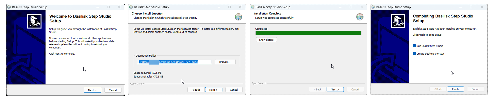

# Basilisk Step Studio

A Windows interface for [stl2step](https://github.com/BlinkingSun/stl2step), a tool for converting STL meshes into STEP B-Rep solids.

stl2step handles the conversion well, but it is a command-line tool with a fairly large set of options, and the upstream desktop app is currently macOS-only. Basilisk Step Studio provides the Windows interface: a batch queue, a 3D viewer for checking results, and a visible command line.


---


---

## Install

Download and run **Basilisk Step Studio_0.1.0_x64-setup.exe**, in the root of this repository. The converter is bundled, so there is nothing else to download and nothing to configure. Roughly 16 MB to download, 53 MB installed.

The installer is not code signed, so Windows shows **"Windows protected your PC"** on first run. Click **More info**, then **Run anyway**.

Drop STL files onto the window and press **Convert**. STEP files are written next to the originals, unless an output folder is set in Settings.

The app keeps itself up to date, and the engine updates separately from the Engine screen.



---

## Conversion modes

**Verbatim** is fast and preserves the mesh exactly, but the STEP remains faceted.

**TrueForm** takes longer because it tries to recover cylinders, planes and other analytic surfaces from the mesh. The result is much closer to what you would expect from native CAD geometry.

### Batch conversion

Files can be queued and converted one after another, for the cases where thirty or forty parts need converting and running the same command per file is not practical. A failed conversion is marked and the queue continues.

### 3D viewer

The viewer shows both the STL going in and the converted result. For STEP results the engine's B-Rep edges are drawn over the shaded model, which is what separates a recovered analytic surface from a re-triangulated one.

### Command line preview

The generated stl2step command is always visible, and changing an option updates it immediately. It also works in reverse: paste an existing stl2step command into the interface and the options are filled in from it. Commands can be exported as `.bat` files.

The idea is not to hide the CLI, only to make it easier to reach.

---

## Building it yourself

For anyone who would rather not run the installer. There are two levels: the interface needs Node and nothing else, and producing your own installer additionally needs a C++ toolchain.

### The interface

```bash
git clone https://github.com/ApexInvent/Basilisk-Step-Studio.git
cd Basilisk-Step-Studio
npm install
npm start
```

`npm start` builds the interface and starts a local helper, which prints a URL containing an access token. Open that URL in a browser.

This works with no engine present. Files can be added, options configured, commands built and STL meshes inspected. Only conversion is held back until an engine is available.

Requires [Node.js](https://nodejs.org) 20 or newer.

### The engine

stl2step is a C++ program built on OpenCASCADE, and upstream publishes no Windows binary. Compiling OpenCASCADE by hand takes about an hour, so this repository builds it for you:

1. Open the **Actions** tab
2. Select **Build engine**, then **Run workflow**
3. Download the `stl2step-windows-x64` artifact when it finishes
4. Extract it into an `engine` folder in the project root

Keep the DLLs beside `stl2step.exe`. They are the OpenCASCADE runtime and the binary will not start without them.

To use an stl2step build you already have, point the helper at it instead:

```bash
npm run sidecar -- --engine C:\path\to\stl2step.exe
```

### The installer

Three things to install once, around 5 GB in total.

| | What | How |
| --- | --- | --- |
| Rust | compiles the desktop shell | [rustup.rs](https://rustup.rs), run `rustup-init.exe`, accept the defaults |
| MSVC C++ build tools | the linker Rust needs on Windows | [Build Tools for Visual Studio](https://visualstudio.microsoft.com/downloads/), tick **Desktop development with C++** |
| WebView2 | renders the interface | already present on Windows 10 and 11, nothing to do |

Or with winget:

```powershell
winget install OpenJS.NodeJS.LTS
winget install Rustlang.Rustup
winget install Microsoft.VisualStudio.2022.BuildTools --override "--quiet --add Microsoft.VisualStudio.Workload.VCTools --includeRecommended"
```

Open a new terminal afterwards so the changes to `PATH` take effect. Then, with an `engine` folder in place:

```bash
npm run tauri build
```

The result lands in `src-tauri/target/release/bundle/nsis/`. The engine is bundled into it, so what comes out converts a file on a machine with nothing else installed.

The first build takes several minutes while Rust compiles its dependencies. Later ones are under a minute. If it stops with **`link.exe` not found**, the C++ workload was not installed.

### Working on it

```bash
npm run dev          # interface only, mock engine, hot reload
npm run tauri dev    # desktop app, hot reload
cd src-tauri && cargo test
```

`npm run dev` needs neither stl2step nor the helper. It runs against a mock engine that returns realistic results and progress, and the app says clearly when that is what you are looking at, so a test conversion cannot be mistaken for a file written to disk.

---

## Credits

All STL-to-STEP conversion is performed by [stl2step](https://github.com/BlinkingSun/stl2step), created by BlinkingSun and built on [OpenCASCADE](https://dev.opencascade.org/).

Basilisk Step Studio provides the Windows interface, queue, viewer and integration around it. The geometry conversion itself belongs entirely to the upstream project.

---

## Licence

Basilisk Step Studio is free software under the [GNU General Public License v3](LICENSE) or later. You may use, study, modify and redistribute it, and anything you distribute that is built from it must carry the same freedoms.

stl2step itself is MIT. OpenCASCADE, the geometry kernel the engine links against, is LGPL 2.1 with the Open CASCADE exception, and the installer redistributes it. What ships and under what terms is set out in [THIRD-PARTY-NOTICES.md](THIRD-PARTY-NOTICES.md).

The Basilisk Step Studio name, logo and icon are trademarks of Apex Invent and are not covered by that grant. Forks are welcome to the code and should use their own name.
